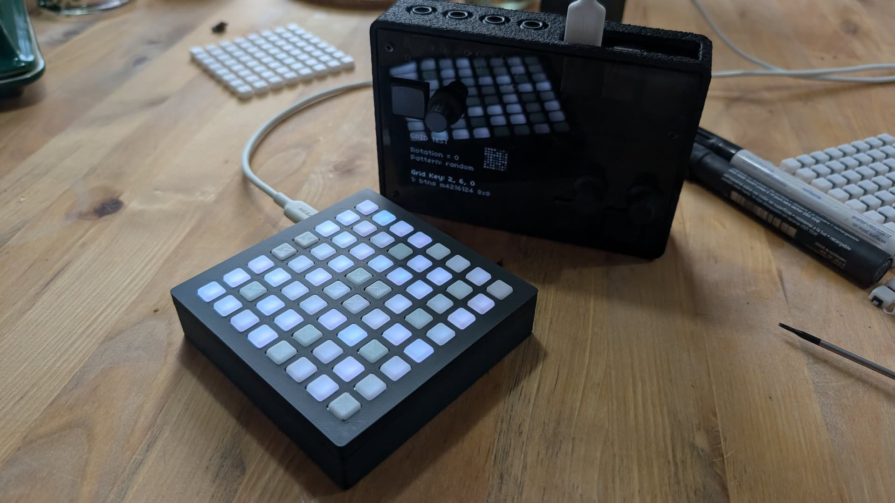

# Overview

small grid 64 clone heavily based on previous work by [hugelton/btns](https://github.com/hugelton/Btns).

Uses a Rasperry Pi Pico Microcontroller, NeoPixel RGB LEDs (SK6812), cheap buttons and a 3d-printed case and button-overlay.
Includes hardware and firmware support for an optional tilt-sensor.

# Building

It is highly recommended to order the PCB assembled from JLCPCB. That assembly will include everything other than the parts in the BOM.

## BOM

| Part                            | Quantity | Source                                                                                                                                                                                                                                                                                                                        | Required                      | 
|---------------------------------|----------|-------------------------------------------------------------------------------------------------------------------------------------------------------------------------------------------------------------------------------------------------------------------------------------------------------------------------------|-------------------------------|
| PCB with components             | 1        | JLCPCB, ordered with Gerber and Assembly files from latest release. Gerber: `butns-JLCPCB.zip`, BOM: `butns_bom_jlc.csv`, CPL: `butns_cpl_jlc.csv`.                                                                                                                                                                                                                                                            | yes                           | 
| Raspberry Pi Pico               | 1        | Original Raspberry Pi Pico, or [USB-C Variant](https://de.aliexpress.com/item/1005007393927221.html)                                                                                                                                                                                                                          | yes                           |   |
| M2.5x6 Button Head Screws       | 5        | [M2.5x6](https://www.aliexpress.com/item/32810852732.html)                                                                                                                                                                                                                                                                    | yes                           | 
| Case                        | 1        | 3d-printed (FDM). `case.stl` contains the top and bottom half. In the image, it is printed in black PLA, 0.2mm layerheight.                                                                                                                                                                                                   | yes                           | 
| Button Matrix                     | 1        | 3d-printed (FDM). Print `buttons.stl` with white PLA and 0.12mm layerheight and no infill, 2 wall lines, concentric top infill. These should guide the LEDs light well. Optional: Add `buttons-black-blockers.stl` while importing as a multi-material print and print those in black to block light from neighboring buttons | yes (black blockers optional) | 
| Button TPU Case Inlay         | 1        | 3d-printed (FDM). Print with TPU, perhaps in black. Will help against rattling of the buttons in the case.                                                                                                                                                                                                                    | no                            | 
| SMD 2.54" Pin Header 1x8 Type A | 1        | [1x8 Type A](https://www.aliexpress.com/item/1005005203849802.html)                                                                                                                                                                                                                                                           | no, for tilt                  | 
| MPU6050 module                  | 1        | [MPU6050 Module](https://www.aliexpress.com/item/1005006396343851.html)                                                                                                                                                                                                                                                       | no, for tilt                  | 

## Assembly

Flash microcontroller with `firmware.uf2`. Solder MCU and Pin-Header to PCB. Screw everything into the case. Done!

Hint: The cases Top half has one specific orientation where it fits nicely: The top-screw-posts of the top-half with the larger cutoaways go to the side opposite of the USB Connector.